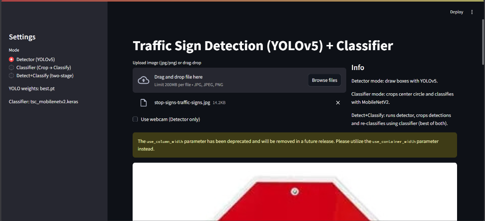
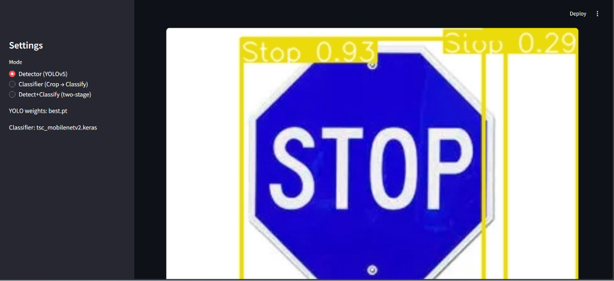

# AI Traffic Sign Classifier

A Streamlit application for detecting and classifying traffic signs using YOLOv5 and MobileNetV2.



## Features

- **Detection**: Uses YOLOv5 to detect traffic signs in images or video streams.
- **Classification**: Uses MobileNetV2 to classify cropped traffic sign images.
- **Two-Stage Pipeline**: Combines detection and classification for accurate results.
- **Web Interface**: Built with Streamlit for easy interaction.



## Installation

1.  **Clone the repository:**
    ```bash
    git clone <repository_url>
    cd ai_traffic_sign_classifier
    ```

2.  **Install dependencies:**
    It is recommended to use a virtual environment.
    ```bash
    pip install -r requirements.txt
    ```

## Usage

1.  **Run the Streamlit app:**
    ```bash
    streamlit run app/streamlit_app.py
    ```

2.  **Interact with the app:**
    - Upload an image.
    - Select the mode (Detector, Classifier, or Detect+Classify).
    - View results.

## Project Structure

- `app/`: Contains the Streamlit application code.
- `src/`: Source code for detection and utility functions.
- `models/`: Pre-trained models (YOLOv5 and MobileNetV2).
- `data/`: Data directory.
